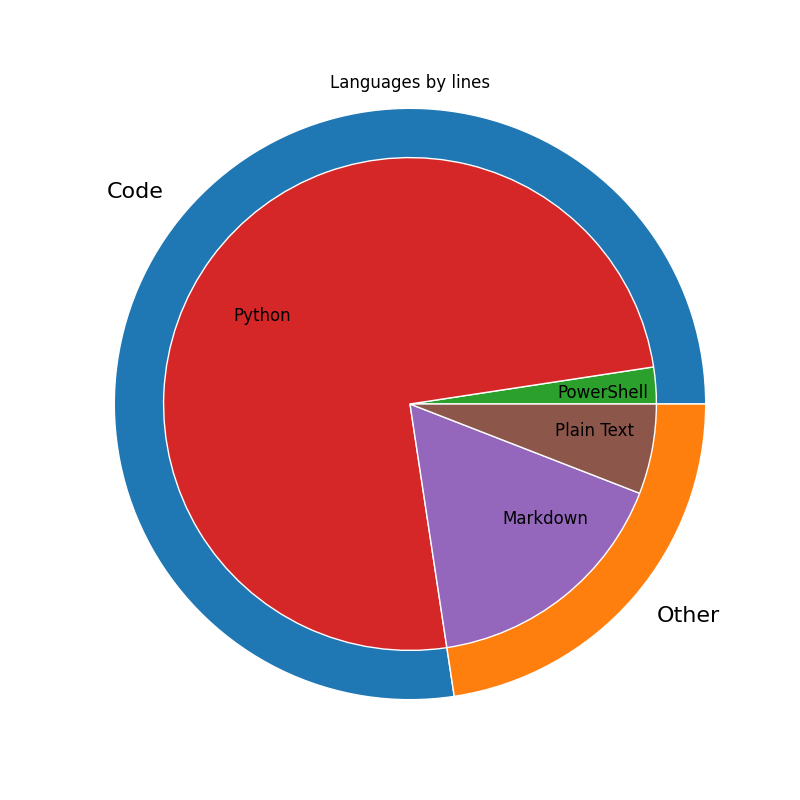

# EDrewcated Guesser V49.1 (Beta)
by Drew Wingfield

[Source](https://github.com/DrewWing/EDrewcatedGuesser).

<!-- Copyright (C) 2024, Drew Wingfield

This document is part of EDrewcated Guesser by Drew Wingfield, found at https://github.com/DrewWing/EDrewcatedGuesser.
EDrewcated Guesser is free software: you can redistribute it and/or modify it under 
the terms of the AGNU Affero General Public License as published by the Free Software 
Foundation, either version 3 of the License, or (at your option) any later version.

EDrewcated Guesser is distributed in the hope that it will be useful, but WITHOUT ANY 
WARRANTY; without even the implied warranty of MERCHANTABILITY or FITNESS FOR A PARTICULAR 
PURPOSE. See the AGNU Affero General Public License for more details.

You should have received a copy of the AGNU Affero General Public License along with 
EDrewcated Guesser. If not, see <https://www.gnu.org/licenses/>.

See the documentation in the README.md file. -->

## About
The EDrewcated Guesser software is aimed at real-time prediction of match outcomes for FIRST Tech Challenge using machine learning algorithms.

Simply put, this software:
  - Runs on your computer or laptop, 
  - Fetches live team data, match data, and match schedules from the FIRST API, 
  - Calculates statistics such as OPR and CCWM, 
  - Predicts match outcomes, and 
  - Pushes the statistics and predictions to a Google Sheets spreadsheet.

> [!Important]
> This software is a CLI intended for advanced users. If you don't know you way around the command line or aren't willing to set up a Google Cloud project, this software is not suited for you. \
> In a future update, a local spreadsheet option will be available.

You can find the license statement [here](LICENSE.txt) (The full GNU Affero General Public License is [here](COPYING)).
The todo list is [here](docs/todos.md).
Also see the [Updates](docs/Updates.md) page.

## Helpful Documentation Links
 - [How to Set Up the Project (Start Here!)](docs/Setup.md)
 - [Running the program](docs/RunningTheProject.md)
   - During an event
   - Outside of an event
 - [Machine Learning Guide (advanced)](docs/MachineLearningGuide.md)

## Contributing
See the [contributing guide](.github/CONTRIBUTING).

## Errors
As always, EDrewcated Guesser is a work in progress and has some bugs. Errors should be both printed to the terminal and appended to `app/generatedfiles/error.log` with a timestamp.

## Language Stats:
Automatically generated by [line_counter.py](line_counter.py).

 
<!-- Created by line_counter.py -->
 

## Credits/Honorable Mentions
Though I wrote almost the entirety of the project by myself, I had some help. Below are some resources that I used (whether for copypasting code, general reference, or other research). All copypasted snippets of code are also cited in their respective locations.

This program uses the official FIRST Tech Challenge API to get information on matches, schedules, and scores.
You can find it [here](https://ftc-events.firstinspires.org/services/API).

Thanks to [The Blue Alliance](https://blog.thebluealliance.com/2017/10/05/the-math-behind-opr-an-introduction/) for an overview of OPR and the math behind it.

Thanks to [this article](https://www.johndcook.com/blog/2010/01/19/dont-invert-that-matrix/) for ideas on matrix calculation.

Printing in BASH with help from some people on [this StackOverflow post](https://stackoverflow.com/questions/1898712/make-sure-int-variable-is-2-digits-long-else-add-0-in-front-to-make-it-2-digits).

Python printing in colors (the `Colors` class in `commonresources.py`) was taken from [Rene-d](https://gist.github.com/rene-d/9e584a7dd2935d0f461904b9f2950007).

The Google Sheets API was implemented with lots of help from [their sample program](https://github.com/googleapis/google-api-python-client/blob/main/samples/service_account/tasks.py) and [quickstart](https://developers.google.com/sheets/api/quickstart/python).

Thanks to viniciusarrud on GitHub in [this Joblib issue](https://github.com/joblib/joblib/issues/1496#issuecomment-1788968714) for a solution to a particular bug involving pathing on Windows.

The diagram `FTCAPI file diagram.drawio` (soon to be exported into an image and put in the docs) was generated using [Drawio](https://app.diagrams.net/) [24.7.7], made by JGraph, https://github.com/jgraph/drawio. \
I am not JGraph, this project is not by JGraph, and JGraph neither endorses me nor this project.

### External libraries

This software uses the following external libraries:

 - Google API Python Client Framework: Copyright Google APIs. Licensed under Apache 2.0 license, see [LICENSES/APACHE2.txt](LICENSES/APACHE2.txt) for details. \
Website: https://github.com/googleapis/google-api-python-client

 - Matplotlib Framework: Copyright (c)
2012- Matplotlib Development Team; All Rights Reserved. Licensed similar to the PSF license, see [LICENSES/MATPLOTLIB.txt](LICENSES/MATPLOTLIB.txt) for details. \
Website: https://matplotlib.org/stable/

 - Pandas Framework: Copyright (c) 2008-2011, AQR Capital Management, LLC, Lambda Foundry, Inc. and PyData Development Team. Licensed under a BSD 3-Clause license, see [LICENSES/PANDAS.txt](LICENSES/PANDAS.txt) for details. \
Website: https://github.com/pandas-dev/pandas

 - Scikit-Learn Framework: Copyright (c) 2011, Pedregosa et al. Licensed under a BSD 3-Clause license, see [LICENSES/SCIKIT-LEARN.txt](LICENSES/SCIKIT-LEARN.txt) for details. \
Website: https://github.com/scikit-learn/scikit-learn

 - PyArrow Framework: Copyright (c) 2024, Richardson N, Cook I, Crane N, Dunnington D, François R, Keane J, Moldovan-Grünfeld D, Ooms J, Wujciak-Jens J, Apache Arrow (2024). arrow: Integration to 'Apache' 'Arrow'. Licensed under Apache 2.0 license, see [LICENSES/APACHE2.txt](LICENSES/APACHE2.txt) for details. \
Websites: https://github.com/apache/arrow/, https://arrow.apache.org/docs/r/.

### EDrewcated Guesser License
 

Copyright (C) 2024, Drew Wingfield

EDrewcated Guesser is licenced under the GNU Affero General Public License as published by the Free Software Foundation, version 3.

EDrewcated Guesser is free software: you can redistribute it and/or modify it under the terms of the GNU Affero General Public License as published by the Free Software Foundation, either version 3 of the License, or (at your option) any later version.

EDrewcated Guesser is distributed in the hope that it will be useful,
but WITHOUT ANY WARRANTY; without even the implied warranty of
MERCHANTABILITY or FITNESS FOR A PARTICULAR PURPOSE.  See the
GNU Affero General Public License for more details.

You should have received a copy of the GNU Affero General Public License
along with this program (in the COPPYING file). If not, see https://www.gnu.org/licenses/.

No Large Language Models (LLMs), chatbots, or any other so-called "AI" tools were used to code, write, or otherwise create resources for EDrewcated Guesser. Apart from a few (cited) snippets from StackOverflow (and various other places), EDrewcated Guesser was created by hand, from scratch.

No Texas A&M University resources were used in the creation of EDrewcated Guesser.
