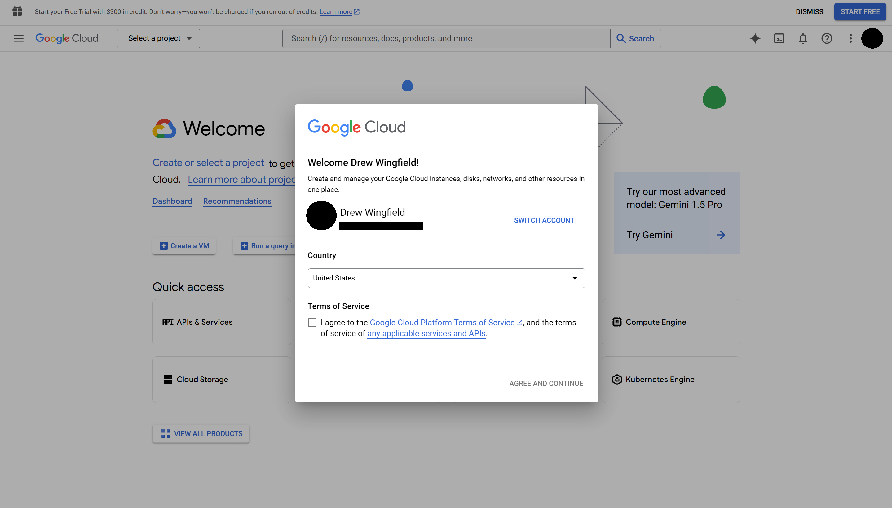
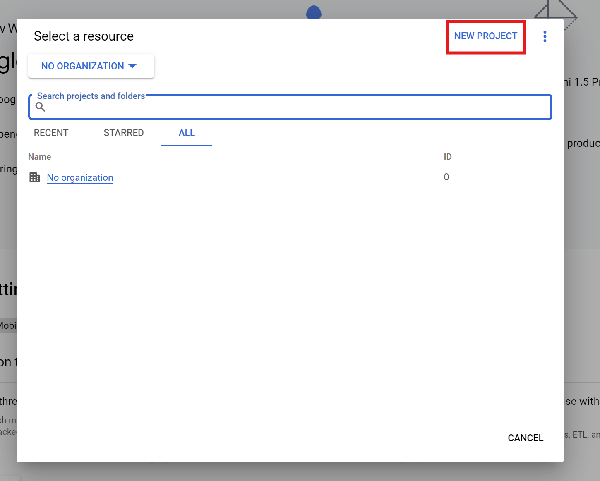
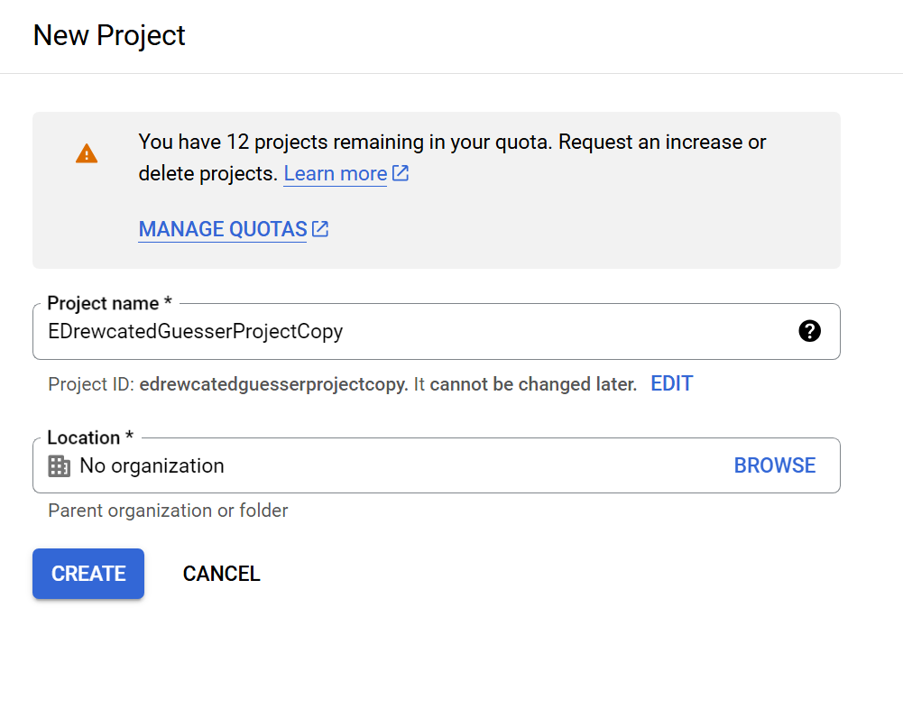
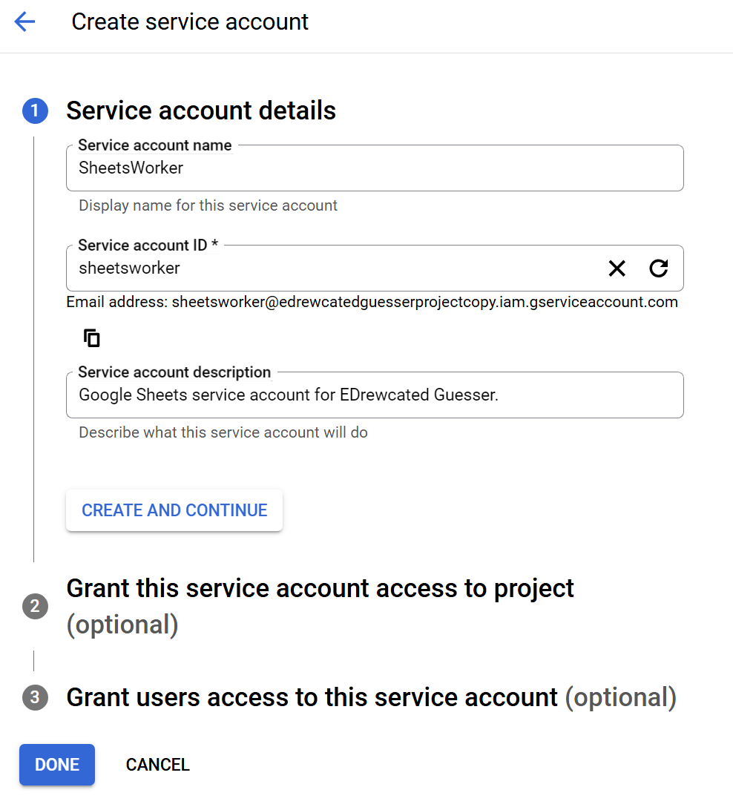
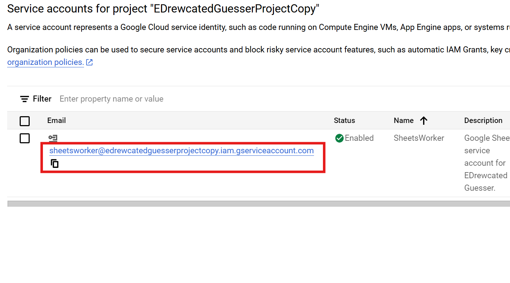
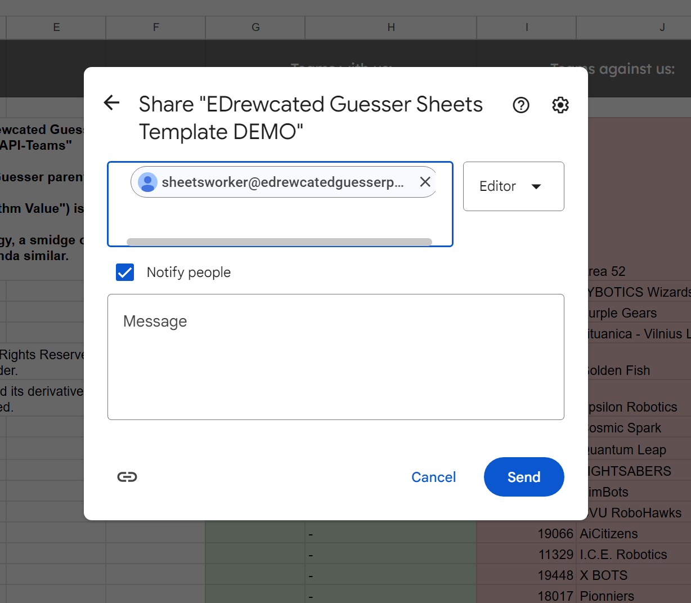

# How to Set Up the Project

# <p style="color:orange"><u>**This Documentation is currently a WORK IN PROGRESS**</u></p>

## Setting Up
Please note that this software needs to be set up correctly to work. If any of the steps are followed incorrectly, this software may fail. If you run into any trouble, see the FAQs and the [Troubleshooting section](#Troubleshooting) below.

### Venv
First of all, you must set up a Virtual Environment and install the required packages. The script `venvSetup.ps1` automatically does this for you.

> *Advanced*: You may change the location of the Virtual Environment with the `VenvName` flag.


### Creating Secrets.txt
#### Basic
You will need to get an API token from FIRST.
Go to [their website](https://ftc-events.firstinspires.org/services/API) and click `Register for API Access`. Fill out the form, and you should recieve a token in your email.


Create a file called `secrets.txt` containing your FIRST API token. Format it as follows:
```
PersonalAccessToken=YOUR_TOKEN_GOES_HERE
```

> *Advanced*: Any variables in `secrets.txt` will be written into `ftcapi.ps1`, <u>after argument parsing</u> (will override arguments). 
> This is a great way to semi-permanently set some arguments without passing them into the script every time. 


### Google Cloud Service Worker
You will need to create a Google Cloud project and service worker, and get a key.
This Service Account will push data to the Google Sheets spreadsheet. If you don't want to deal with the hell that is Google APIs, you can wait a bit for me to implement a non-google-sheets-pushing feature.


#### Agree to Google Cloud's Terms
Go to [console.cloud.google.com](https://console.cloud.google.com), sign in *using a non-school account*, and agree to their terms. You do *not* need to start any free trials, just ignore those messages when they pop up.




#### Create a Google Cloud Project.
Click on `Select a Project` in the top left, then `Create New Project`.

<!--  -->


Name your project something memorable, and <u>don't associate it with an organization.</u> Then hit `Create` and wait a second for it to load your new project.

> Note: If you are having trouble creating the project or are getting permissions errors, make sure you are not using a school account.

<!--  -->


#### Create a Service Account
The last step should have loaded you into the dashboard. In the left pane, click on `IAM & Admin` -> `Service Accounts`, then `Create Service Account`.


Fill in the account name and description (optional). An ID will be automatically generated, but you can input it manually as well. This ID will be part of the email address of the service account. <br>
My reccomondation is to name it something accurate like "SheetsWorker" or "GoogleSheetsData." Future you will thank you.

After clicking `Continue`, you will select a role. Select `Basic` -> `Viewer`, then hit `Continue`.
If you know what you're doing, you may grant users access to the service account, but otherwise just hit `Done`.


#### Download the API Key
Create an API access key via `Keys` -> `Add Key` -> `Create New Key`. You want a `Json` type key.

This will download a `.json` file, which you should rename to something convenient like `google-sheets-api-key.ignore.json` and place in the EDrewcated Guesser project folder.

You should then modify `SERVICE_ACCOUNT_FILE` in `common_resources.py` to match the file name. <!-- TODO: update this when it's changed to being in secrets.txt  -->

> **Warning:** This API key should be kept secret and not shared.
> People who have that key have access to your Google Sheets and may mess stuff up. 


---

### Common Resources
<!-- TODO: Update this when it's changed to secrets.txt -->
Certain variables in commonresources.py need to be set up correctly;
 - `SERVICE_ACCOUNT_FILE` (string) is the path to the .json file where your Service Account authentication key is stored.

 - `SPREADSHEET_ID` (string) is the ID of the google spreadsheet you want to push data to, found in the URL of the spreadsheet; https://docs.google.com/spreadsheets/d/spreadsheet_id_goes_here/edit. Ex: `1VZYXmJQ7jPPnCTyCnhFSYAuuTAymZbRimxe0GQYx_L4`


---

#### Set Up the Spreadsheet
Copy [this spreadsheet](https://docs.google.com/spreadsheets/d/1VZYXmJQ7jPPnCTyCnhFSYAuuTAymZbRimxe0GQYx_L4/edit?usp=sharing) and share it with your newly created service account. This ensures that your Service Account can actually access the Google Sheets spreadsheet.





## Troubleshooting

#### Google Cloud is giving me errors related to organizational settings
Do not use a work or school account, as their organizational structure was probably set up a certain way that breaks things for this project. Use a personal Google account not managed by any organization.

#### I need help with Google Cloud in general
For more refernce, see https://stackoverflow.com/a/76838253.
