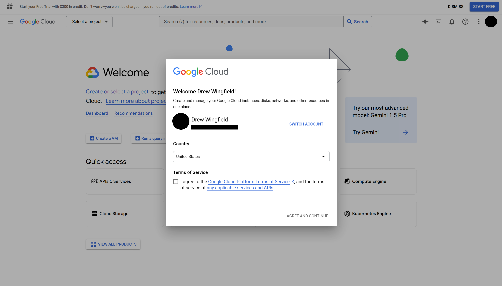
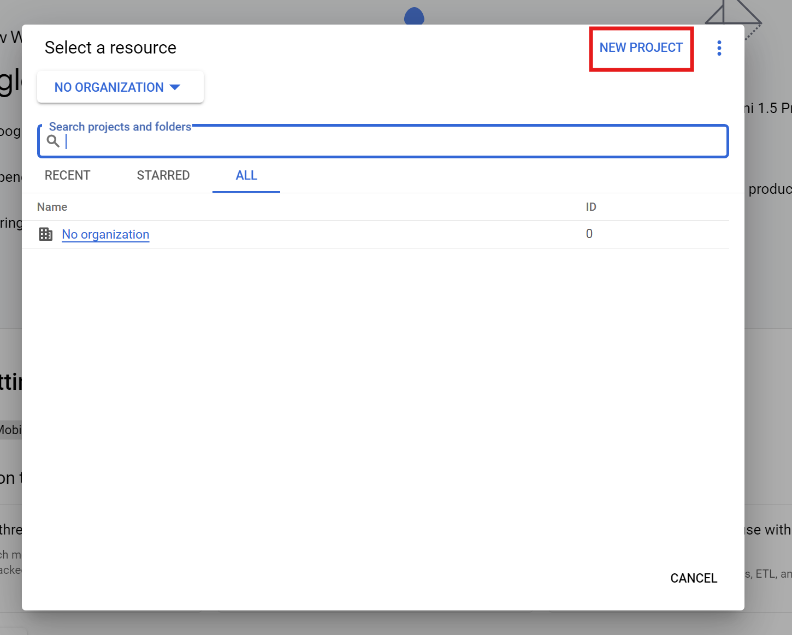
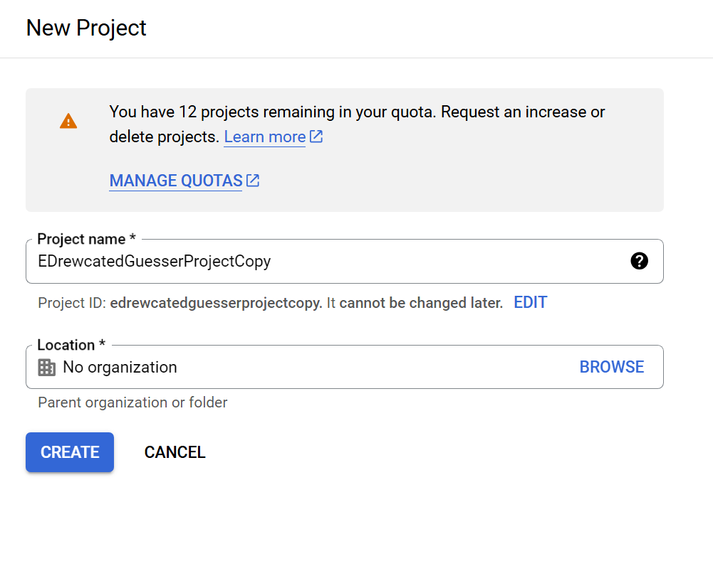
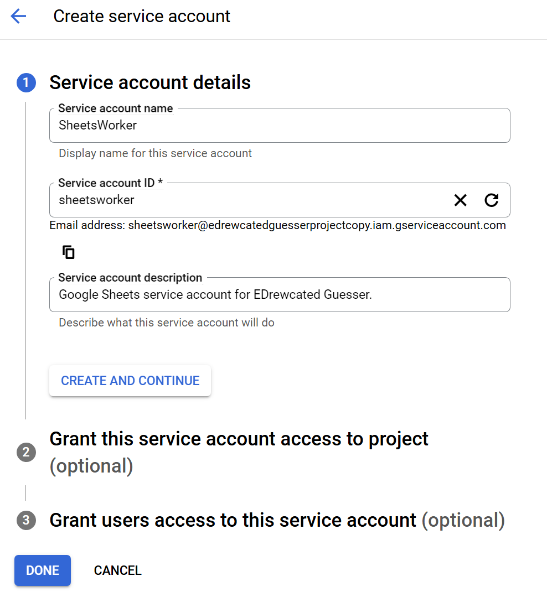
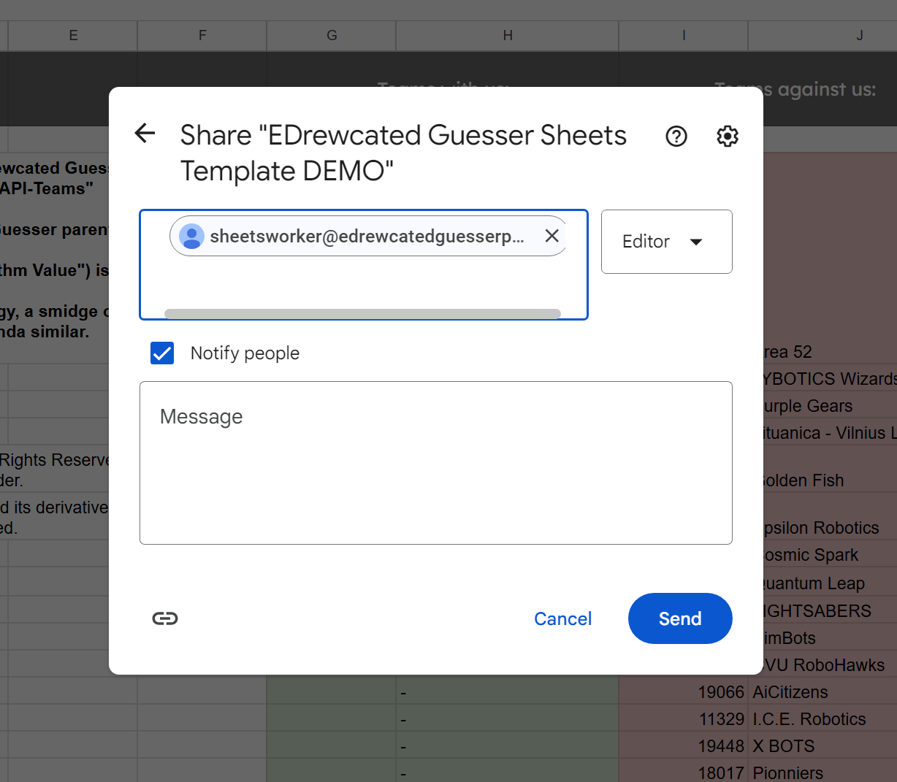

# Setup Google Sheets

<!-- Copyright (C) 2024, Drew Wingfield

This document is part of EDrewcated Guesser by Drew Wingfield, found at https://github.com/DrewWing/EDrewcatedGuesser.
EDrewcated Guesser is free software: you can redistribute it and/or modify it under 
the terms of the AGNU Affero General Public License as published by the Free Software 
Foundation, either version 3 of the License, or (at your option) any later version.

EDrewcated Guesser is distributed in the hope that it will be useful, but WITHOUT ANY 
WARRANTY; without even the implied warranty of MERCHANTABILITY or FITNESS FOR A PARTICULAR 
PURPOSE. See the AGNU Affero General Public License for more details.

You should have received a copy of the AGNU Affero General Public License along with 
EDrewcated Guesser. If not, see <https://www.gnu.org/licenses/>.

See the documentation in the README.md file. -->

## Google Cloud Service Worker
You might want to create a Google Cloud project and service worker, and get a key.
This Service Account will push data to the Google Sheets spreadsheet. 

> [!Note] 
> If you don't want to deal with the hell that is Google APIs, you
> may skip this section.


### Agree to Google Cloud's Terms
Go to [console.cloud.google.com](https://console.cloud.google.com), sign in *using a non-school account*, and agree to their terms. You do *not* need to start any free trials, just ignore those messages when they pop up.




### Create a Google Cloud Project.
Click on `Select a Project` in the top left, then `Create New Project`.

<!--  -->


Name your project something memorable, and <u>don't associate it with an organization.</u> Then hit `Create` and wait a second for it to load your new project.

> [!Note]
> If you are having trouble creating the project or are getting permissions errors, make sure you are not using a school account.

<!--  -->


### Create a Service Account
The last step should have loaded you into the dashboard. In the left pane, click on `IAM & Admin` -> `Service Accounts`, then `Create Service Account`.


Fill in the account name and description (optional). An ID will be automatically generated, but you can input it manually as well. This ID will be part of the email address of the service account. <br>
It is recommended to name it something accurate such as "SheetsWorker" or "GoogleSheetsData." Future you will thank you.

After clicking `Continue`, you will select a role. Select `Basic` -> `Viewer`, then hit `Continue`.
If you know what you're doing, you may grant users access to the service account, but otherwise just hit `Done`.


### Download the API Key
Create an API access key via `Keys` -> `Add Key` -> `Create New Key`. You want a `Json` type key.

This will download a `.json` file, which you should rename to something convenient like `google-sheets-api-key.ignore.json` and place in the EDrewcated Guesser project folder.
> [!Caution] 
> This API key should be kept secret and not shared.
> People who have that key have access to your Google Sheets spreadsheets and may modify them. 

You should then modify `SERVICE_ACCOUNT_KEY_PATH` in the `.env` file, replacing  `path/to/service/account/key.json` with the new json file path.

---

### Set Up the Spreadsheet
Copy [this spreadsheet](https://docs.google.com/spreadsheets/d/1VZYXmJQ7jPPnCTyCnhFSYAuuTAymZbRimxe0GQYx_L4/edit?usp=sharing) and share it with your newly created service account. This ensures that your Service Account can actually access the Google Sheets spreadsheet.

Then modify `GOOGLE_SPREADSHEET_ID` in your `.env` file to the Spreadsheet ID, found in the URL of the spreadsheet: 
```
docs.google.com/spreadsheets/d/the_spreadsheet_id_is_here/edit. 
```
For instance, the Spreadsheet ID of the example spreadsheet is `1VZYXmJQ7jPPnCTyCnhFSYAuuTAymZbRimxe0GQYx_L4`.
<br>





## Next Step
If you've followed these instructions, everything should be properly set up for the Google Sheets spreadsheet. In that case, resume the steps in [How to Set Up the Project](Setup.md),


## Troubleshooting

#### Google Cloud is giving me errors related to organizational settings
Do not use a work or school account, as their organizational structure was probably set up a certain way that breaks things for this project. Use a personal Google account not managed by any organization.

#### I need help with Google Cloud in general
For more refernce, see https://stackoverflow.com/a/76838253.

